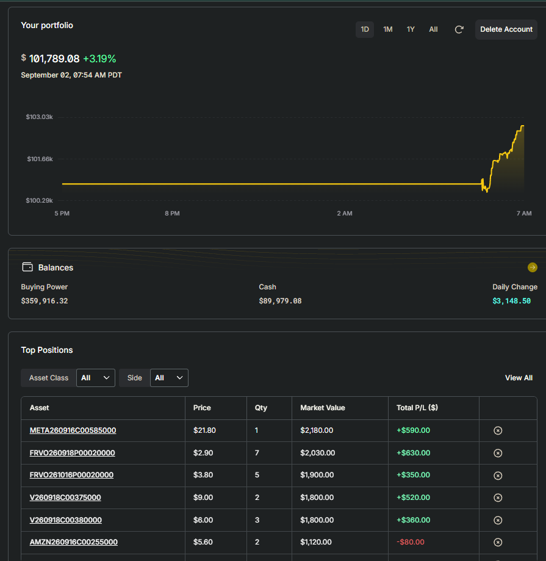

# alpaca-options-trading-agents

[](https://github.com/miramar-labs/alpaca-options-trading-agents/actions/workflows/test-lint.yaml)
[](https://github.com/miramar-labs/alpaca-options-trading-agents/actions/workflows/build-push.yaml)
[](LICENSE)
[](https://app.alpaca.markets/paper/dashboard/overview)
[](https://app.alpaca.markets/paper/dashboard/overview)
[](config.yaml)

A 3-agent options-trading floor built for the **Alpaca AI Trading Agents Hackathon**
(lablab.ai, 28 Aug – 4 Sep 2026), trading live on Alpaca's competition $100k paper account.
Every agent's LLM call runs as **local inference on an NVIDIA DGX Spark**, via Ollama — no
external LLM API. The whole stack — agents, LLM inference, Postgres, and CI/CD — runs on that
one machine; nothing but Alpaca/TAAPI/Finnhub/Slack/GitHub traffic ever leaves it.

- **Analyst** — each morning, screens the market and picks the day's tradeable universe.
- **Dealer** — polls each symbol for a BUY / SELL / HOLD signal, then uses an **Alpaca MCP**
  tool-calling loop to browse the live option chain and pick a specific contract to trade.
- **Floor Broker** — a FastAPI executor that re-validates the pick, places the order on
  Alpaca, and manages synthetic stop-loss / take-profit / expiration exits (Alpaca has no
  server-side brackets for options).

Layered risk gates (confidence threshold, macro-event blackout, stop-loss cooldown, win-rate
throttle, daily halt, notional cap, a runtime kill switch), a daily end-of-day Slack recap, and
live P/L + model badges round it out. See [`docs/hackathon-writeup.md`](docs/hackathon-writeup.md)
for the submission narrative and [`docs/architecture.md`](docs/architecture.md) for full
technical detail.

The agent skeleton and risk gates build on an existing multi-agent equity-trading framework of
mine; the options capability — MCP contract selection, options execution, synthetic exits, EOD
reporting — is the hackathon work. See [What's new here](docs/hackathon-writeup.md#whats-new-here).



*The competition paper account on the morning of 2 Sep 2026, holding the option positions opened on day 1 (1 Sep).*

## Repo layout

```
alpaca-options-trading-agents/
├── config.yaml           # single source of config for every agent -- fetched live from GitHub, not baked into images
├── Dockerfile.*           # one per workload
├── k8s/                   # CronJobs, Deployments, Service, RBAC, ConfigMaps, secrets.example.yaml
├── src/
│   ├── common/            # Alpaca client, config loader, logger, Slack, Postgres, portfolio I/O
│   ├── analyst/            # CronJob -- picks the tradeable universe
│   ├── dealer/              # Deployment -- BUY/HOLD/SELL signal + Alpaca MCP contract selection
│   ├── floor_broker/        # Deployment+Service -- order execution
│   ├── eod_report/           # CronJob -- daily Slack recap
│   ├── pl_badges/             # README P/L badge refresh (GitHub Actions)
│   └── model_badge/           # README "Dealer LLM" badge refresh (GitHub Actions)
├── tests/                 # mirrors src/
└── docs/                  # architecture.md, hackathon-writeup.md
```

## Development

```sh
python3.12 -m venv .venv
.venv/bin/pip install -r requirements.txt -r requirements-dev.txt
.venv/bin/pytest -q
.venv/bin/ruff check .
```

## Deployment

Runs entirely on a single **NVIDIA DGX Spark**, self-hosted, no cloud compute involved. That
one machine hosts:

- a **k3s** Kubernetes cluster running all four agent workloads (namespace
  `alpaca-options-trader`),
- **Ollama**, serving `qwen3.6:35b-a3b` for every Analyst/Dealer decision and the MCP contract
  selector — local inference, not an external LLM API,
- the shared **Postgres** instance backing the audit/persistence tables, and
- a self-hosted **GitHub Actions** runner that handles the whole CI/CD path: push → test + lint
  → (on `main`) build + push 4 images to GHCR → (on a green build) roll out to the cluster.

See [`k8s/secrets.example.yaml`](k8s/secrets.example.yaml) for the one secret every workload
needs (`mlabs-api-keys`: Alpaca creds, TAAPI/Finnhub/LangSmith keys, the Postgres connection
string, and a Slack webhook) and [`docs/architecture.md`](docs/architecture.md#secrets) for
what each key is used for.

## License

[MIT](LICENSE).
