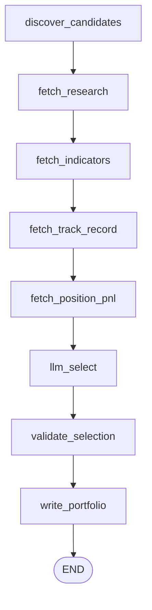
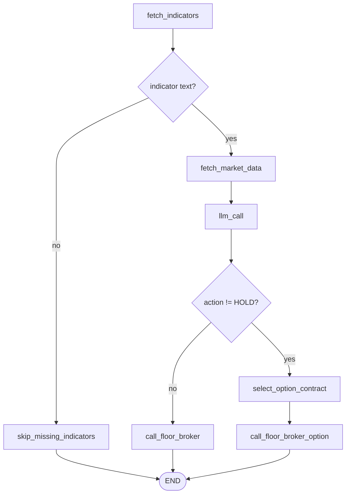
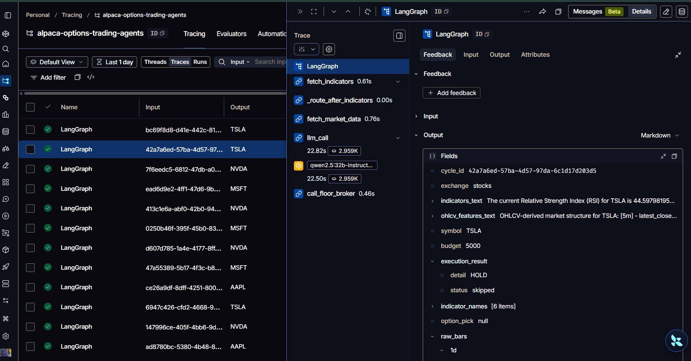
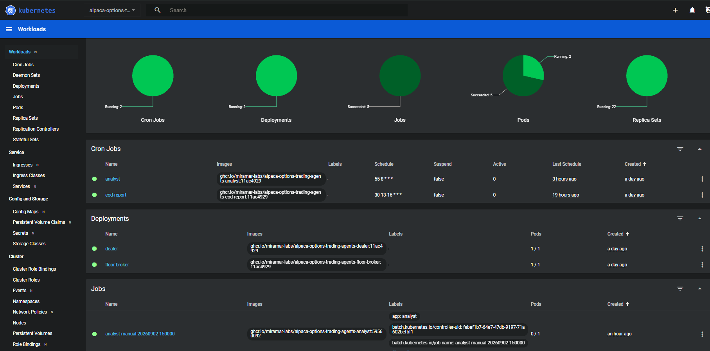
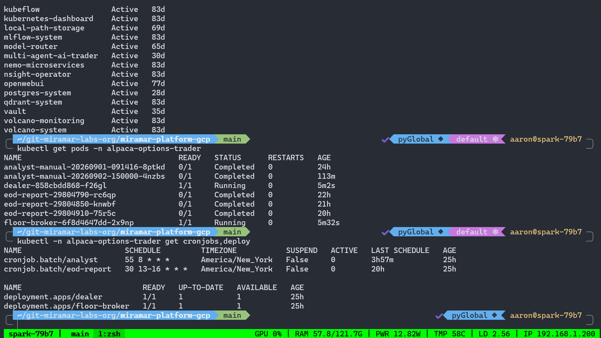
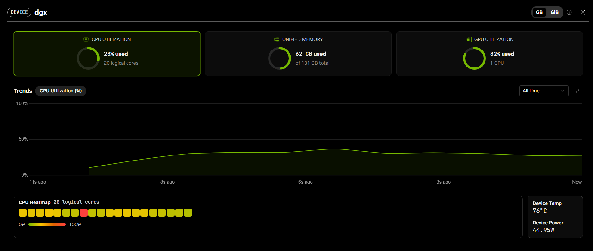
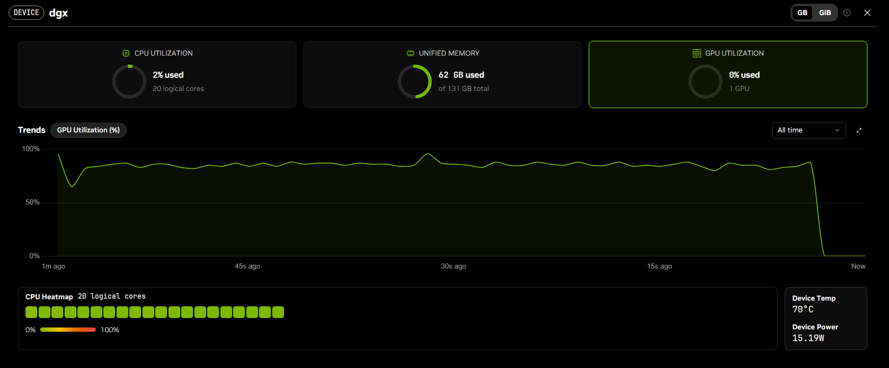

# Architecture

`alpaca-options-trading-agents` is a three-agent trading floor — **Analyst**, **Dealer**,
**Floor Broker** — that trades US equities as single-leg **options** on one Alpaca paper
account, deployed as independent Kubernetes workloads on a DGX Spark k3s cluster. Each agent
is its own Docker image and workload; they scale, restart, and fail independently, and
communicate only through a k8s ConfigMap and a single in-cluster HTTP hop.

```
              08:55 America/New_York daily (k8s CronJob)
                         ┌─────────────────────────┐
                         │         Analyst          │
                         │  screener → news → LLM   │
                         └────────────┬─────────────┘
                                      │ writes
                                      ▼
                         ┌─────────────────────────┐
                         │  "portfolio" ConfigMap    │  ◄── no MLflow/DB, just a
                         │  {symbol, budget,        │      k8s API object
                         │   indicators, rationale} │
                         └────────────┬─────────────┘
                                      │ reads every poll
                                      ▼
                         ┌─────────────────────────┐
        every 600s  ───► │          Dealer          │  (long-running Deployment)
        while market     │ indicators + bars → LLM  │
        is open          │  → Alpaca MCP option pick │
                         └────────────┬─────────────┘
                                      │ HTTP POST /execute-option
                                      ▼
                         ┌─────────────────────────┐
                         │       Floor Broker        │  (Deployment + Service)
                         │  Alpaca order placement   │
                         └────────────┬─────────────┘
                                      │
                                      ▼
           a dedicated Alpaca paper account ($100k), created for the hackathon
```

Analyst and Floor Broker never talk to each other directly. There is no message queue and no
shared filesystem — the only *coordination* state between agents is the `portfolio` ConfigMap,
and the only network hop is Dealer → Floor Broker. Separately, all three agents also write
fire-and-forget history rows to Postgres (see [Persistence](#persistence)) — an append-only
audit trail, not a coordination channel any agent depends on to function.

Independently of that cycle, a fourth CronJob queries Alpaca directly once a day after market
close and posts a summary to Slack:

```
               13:30-16:30 America/New_York :30 checks (k8s CronJob)
                         ┌─────────────────────────┐
                         │       EOD Report        │
                         │ close+30 → Slack recap  │
                         └─────────────────────────┘
```

## Repo layout

```
alpaca-options-trading-agents/
├── config.yaml                  # single source of config for all agents + EOD report -- fetched
│                                  # live from GitHub at runtime (main branch), not baked into images
├── Dockerfile.analyst/.dealer/.floor-broker/.eod-report
├── k8s/                          # 2 CronJobs, 2 Deployments, 1 Service, RBAC, ConfigMaps, secrets doc
└── src/
    ├── common/                   # shared: Alpaca client, config loader, logger, portfolio I/O, Slack, DB
    ├── analyst/                  # CronJob — picks the tradeable universe, posts the morning report
    ├── dealer/                   # Deployment — decides BUY/HOLD/SELL per symbol, picks the option contract
    ├── floor_broker/             # Deployment+Service — executes option orders on Alpaca
    ├── eod_report/                # CronJob — posts a daily account/trade summary to Slack
    ├── pl_badges/                 # cron job (GitHub Actions) — refreshes the README P/L badges
    └── model_badge/               # on `config.yaml` push (GitHub Actions) — refreshes the "Dealer LLM" badge
```

Dealer needs exactly one replica (`strategy: Recreate`) to avoid two pods racing on the same
portfolio. Floor Broker is a stateless request/response service that holds no state of its own
— everything it tracks in memory is rebuilt from Alpaca + Postgres on restart (see
[Restart recovery](#restart-recovery)).

## Agent 1 — Analyst (`src/analyst/`)

**Workload:** `batch/v1 CronJob`, schedule `55 8 * * *` with `timeZone: America/New_York`
(08:55 ET, 35min before the 9:30 ET open — the run itself takes ~5min, dominated by the TAAPI
indicator-fetch throttle), `concurrencyPolicy: Forbid`, `backoffLimit: 1`. Entrypoint:
`python -m src.analyst.main`. Runs every scheduled day regardless of whether the stock market
is open (Alpaca calendar check), so a closed day still posts a Morning Report noting the market
is shut.

**Purpose:** once a day, decide *which symbols are worth trading today* and hand that list off
to the Dealer.

**Implementation:** a LangGraph state machine (`src/analyst/graph.py`) over an `AnalystState`:

| Node | What it does |
|---|---|
| `discover_candidates` | composes a stock candidate pool as a fixed percentage mix (`analyst.candidate_mix`): 40% large-cap (`analyst.large_cap_symbols` — AAPL, MSFT, NVDA, etc.), 30% today's screener movers, 30% held back for crypto (crypto is disabled by config in this repo, so that share redistributes to the other two buckets). The earnings-blackout filter (`earnings_blackout.enabled`, via Finnhub) drops a candidate reporting earnings soon before it's even considered |
| `fetch_research` | Alpaca News API (2 days) + Yahoo Finance RSS headlines, concatenated into plain text |
| `fetch_indicators` | ranks candidates by `abs(change_pct)` and pulls TAAPI `rsi/macd/vwap/bbands/sma/ema` for the top `analyst.indicator_fetch_limit` (15), one `/bulk` request per symbol, throttled to TAAPI's free-tier 1 req/15s cap — `analyst.large_cap_symbols` always get real indicator data regardless of ranking |
| `fetch_track_record` | reads the Analyst's own recent pick history plus Dealer/Floor Broker outcomes from Postgres — qualitative context, no computed P&L |
| `fetch_position_pnl` | a live unrealized P&L snapshot of everything currently held (`trading_client.get_all_positions()`) |
| `llm_select` | the decision LLM call — see below |
| `validate_selection` | drops any pick whose symbol wasn't actually a candidate (a hallucination), then greedily drops trailing picks once their summed `budget` would exceed `analyst.max_total_budget_usd` |
| `write_portfolio` | patches the `portfolio` ConfigMap via the `kubernetes` Python client, then posts a "Morning Market Report" to Slack (picks, rationale, account equity/cash/buying power) |



**LLM call:**
```python
llm = ChatOpenAI(
    base_url=cfg.llm.base_url,
    api_key="not-needed",
    model=cfg.llm.model,
    temperature=cfg.llm.temperature,
    timeout=cfg.llm.request_timeout_s,   # per-request wall-clock ceiling
    max_retries=0,                        # a hung generation must fail fast, not retry into a slow host
).with_structured_output(PortfolioSelection)
```
The system prompt instructs the model to pick at most `analyst.max_universe_size` (10) symbols
from the candidates/research, each with a `budget` (default 5000), an `indicators` list, and a
rationale — enforced as structured JSON via `PortfolioSelection` (pydantic,
`src/analyst/schema.py`); there is no manual JSON-parsing/regex step.

**Output — the `portfolio` ConfigMap** (namespace `alpaca-options-trader`):
```json
{
  "generated_at": "2026-09-01T12:55:03Z",
  "symbols": [
    {"symbol": "NVDA", "exchange": "stocks", "budget": 5000, "indicators": ["rsi","macd","vwap","bbands","sma","ema"], "rationale": "..."}
  ]
}
```
This is the **only** interface between Analyst and the rest of the system.

## Agent 2 — Dealer (`src/dealer/`)

**Workload:** `apps/v1 Deployment`, `replicas: 1`, `strategy: {type: Recreate}`. No ports
exposed (it's a loop, not a server). Entrypoint: `python -m src.dealer.main`.

**Purpose:** continuously, while the market is open, decide BUY/HOLD/SELL for every symbol in
the current portfolio, turn each non-HOLD stock signal into a specific option contract, and
hand it to Floor Broker.

**Main loop** (`src/dealer/main.py`):
```
while True:
    if market_is_open(cfg):              # Alpaca clock + 15-min post-open buffer
        portfolio = read_portfolio()      # fresh read of the ConfigMap every cycle, no caching
        for symbol in portfolio.symbols:
            try:
                graph.invoke(DealerState(...), config={"tags": ["dealer"]})
            except Exception:
                log_and_continue()        # one bad symbol never kills the loop/pod
    sleep(cfg.trading.pollsecs)           # 600s (10 min)
```

**Graph** (`src/dealer/graph.py`):

| Node | What it does |
|---|---|
| `fetch_indicators` | pulls every configured TAAPI indicator for the symbol in one `/bulk` POST |
| `skip_missing_indicators` | terminal fallback when TAAPI returns no data (e.g. a thinly-traded symbol) — records `HOLD` and skips the cycle |
| `fetch_market_data` | Alpaca OHLCV bars at 5m/1h/1d, plus derived market-structure features (return, volatility, ATR, VWAP distance, relative volume, EMA context — `src/dealer/features.py`) |
| `llm_call` | the decision LLM call — see below |
| `select_option_contract` | **only reached when `action != HOLD`** — an MCP-backed tool-calling agent that turns the underlying signal into one option contract. See [Options trading](#options-trading--mcp-backed-contract-selection) below |
| `call_floor_broker` | HOLD signals only — sent to Floor Broker as a no-op skip so it still gets a `dealer_decisions` row and Slack line |
| `call_floor_broker_option` | HTTP `POST /execute-option` to Floor Broker with the selected contract, after re-validating the pick server-side and sizing the order |



Every graph run is traced to LangSmith (`LANGCHAIN_API_KEY`, project
`alpaca-options-trading-agents`), tagged `dealer`:



*One cycle for AAPL: `fetch_indicators` (1.6s) -> `fetch_market_data` (1.1s) ->
`llm_call` (30.5s, ~5.6k tokens) -> `call_floor_broker` (0.4s). The model
returned HOLD, so `execution_result` is `{detail: HOLD, status: skipped}`,
`option_pick` is null, and the contract-selection node is never entered. This
trace was captured while the Dealer still ran `qwen3.6:35b-a3b`; it now runs
`qwen2.5:32b-instruct-q4_K_M` (see [models.md](models.md)).*

**LLM call:** same pattern as Analyst — `ChatOpenAI(base_url=cfg.llm.base_url,
...).with_structured_output(Signal)`. System prompt: *"You are an expert technical trader in
stocks. Based on the values of ALL of the indicators below, decide if you should BUY, SELL, or
HOLD."* The `Signal` model (`src/dealer/schema.py`) is `{symbol, action: BUY|HOLD|SELL,
reasoning, size_hint, confidence}` — `confidence` (0–1) drives the `strategy.min_confidence`
gate (0.6 in this repo): a BUY/SELL below the threshold is skipped locally before Floor Broker
is ever called.

When `strategy.dealer_memory.enabled` is true, the prompt also includes recent same-symbol
Dealer decisions and Floor Broker outcomes from Postgres — intentionally advisory context; the
hard safety rules (stop-loss cooldown, win-rate throttle) are still enforced deterministically
in code, not by the model.

### Options trading — MCP-backed contract selection

This is the piece the hackathon is built around. Every stock BUY/SELL signal — never crypto,
which is disabled in this repo — routes through `select_option_contract` →
`call_floor_broker_option` instead of a plain equity order. The Dealer's own `Signal` LLM call
is unchanged: it still decides BUY/SELL/HOLD on the *underlying*, and that direction maps to
`right = "call" if action == "BUY" else "put"` — a bearish SELL becomes a long put, **never a
short position**.

**Contract selector** (`_select_option_contract_async`, `src/dealer/graph.py`) — a LangChain
tool-calling loop (≤ 6 rounds) using the same `cfg.llm` model as the Dealer's signal call, bound
to Alpaca's options tools via **MCP**:

- `src/dealer/mcp_options.py` launches the `alpaca-mcp-server` package
  (`langchain-mcp-adapters`' `MultiServerMCPClient`, stdio transport) with
  `ALPACA_TOOLSETS=assets,options-data,account` — **read-only**; the Dealer never places orders
  over MCP, only Floor Broker does that, over the plain REST trading client.
- The LLM is given the underlying, the desired `right`, and the config windows (`dte_min`/
  `dte_max` = 14–45 days, `target_delta_min`/`target_delta_max` = 0.30–0.60, `min_open_interest`,
  `min_volume`), calls the MCP tools to pull the live option chain, quotes, and Greeks, then
  returns a structured `OptionContractPick` (`src/dealer/schema.py`): `contract_symbol`,
  `strike`, `expiration`, `right`, `delta`, mid-price `premium`, and a per-contract `reasoning`.
- The loop is **token-bounded** — raw chain JSON is compacted to ≤40 delta-ranked rows before
  entering the message history (`src/dealer/option_chain.py`), the loop stops requesting tools
  past ~12k estimated tokens, and each LLM call has a `llm.request_timeout_s` ceiling with no
  retries. If structured output still fails or comes back empty, `_fallback_pick` deterministically
  picks from the rows already seen (delta + DTE + quote gates) instead of returning nothing —
  see the [structured-output caveat](hackathon-writeup.md#challenges--learnings) in the write-up.
  `scripts/check_contract_selection.py` exercises this whole path against the live chain, gates
  aside, and reports whether the model picked or fell back.
- The structured pick is **validated** (`right` must match the intended direction, and the
  `contract_symbol` must be one actually seen in a chain response — a hallucinated or
  wrong-direction pick is rejected in favor of the direction-safe fallback), then **reconciled**:
  `strike`/`expiration`/`right`/`delta`/`premium` are overwritten with the values actually
  observed for that contract in the chain — only the model's `reasoning` text survives. This
  stops a schema-valid pick with a fabricated premium or an in-window delta from driving
  execution off model-supplied numbers.

**`call_floor_broker_option`** re-validates the pick server-side before executing — it does not
trust the LLM's copy of the constraints:
- A duplicate guard (`GET /option-exposure` on Floor Broker) skips a contract already held or
  with a BUY in flight, silently — `_fallback_pick` is deterministic, so a slow-filling contract
  would otherwise be re-picked identically every ~10-minute poll cycle.
- The same entry gates as the equity path apply unconditionally: macro blackout, same-symbol
  stop cooldown, win-rate throttle, `budget > 0`.
- DTE is recomputed (must fall in `[14, 45]`), `abs(delta)` is recomputed (must fall in
  `[0.30, 0.60]`), and sizing is `qty = int(risk_per_trade_usd // (premium * 100))` —
  `risk_per_trade_usd` is 100 in this repo, so a $1.75 mid-price contract sizes to `qty=0` and is
  skipped, not clamped up.
- On success it POSTs `POST /execute-option` to Floor Broker with the reconciled contract
  details.

## Agent 3 — Floor Broker (`src/floor_broker/`)

**Workload:** `apps/v1 Deployment` + `ClusterIP Service` on port 8000. Uses a ServiceAccount to
read the `buy-kill-switch` ConfigMap — it never reads/writes the `portfolio` ConfigMap
Analyst/Dealer use. Entrypoint: `uvicorn.run("src.floor_broker.app:app", host="0.0.0.0",
port=8000)`.

**Purpose:** the only component that actually talks to Alpaca's *trading* API. Purely
mechanical — it never calls an LLM.

**API** (`src/floor_broker/app.py`):

| Route | Purpose |
|---|---|
| `GET /healthz` | `{"status": "ok"}` — backs the Deployment's readiness/liveness probes |
| `POST /execute-option` | body: `{contract_symbol, qty, premium, right, strike, expiration, delta, reasoning, symbol, cycle_id}` → `execution.buy_option()`. Refuses a second BUY for a contract already held or with a BUY in flight |
| `GET /option-exposure` | `{contracts: [...]}` — every option contract this process holds or has a BUY order in flight for. The Dealer checks this before a new option entry to skip a duplicate early |

**Order logic** (`src/floor_broker/execution.py`):
- **`buy_option()`** — the options entry path, on the one live paper account. Runs the same
  buy-preflight and `max_concurrent_positions` skips as the equity path — option BUYs share the
  account's daily-P&L halt and open-position cap. Re-quotes the contract's live ask before
  submitting and rejects it if `qty * live_ask * 100` exceeds `options_trading.max_notional_usd`
  (2000 in this repo) — the cap is enforced against the market, not the LLM's claimed premium. A
  plain `MarketOrderRequest` is submitted and the function returns `status="submitted"`
  immediately; the position and its `options_trades` DB row are written **only on a confirmed
  fill**, asynchronously (see below).
- **`sell_option()`** — closes an option position. Submit-only, same async-fill pattern.

**Asynchronous order submission.** `buy_option()`/`sell_option()` submit to Alpaca and return
immediately — they don't block waiting to learn whether the order filled. A background poll
thread, `poll_pending_option_fills()` (every 30s), re-fetches each tracked order and, once
`filled_avg_price` is populated, records the fill (Postgres row + Slack post) and drops the
entry. `src/floor_broker/main.py` starts several daemon threads alongside uvicorn in the same
process for this and for the synthetic-exit and reconciliation logic below.

**Option synthetic stop-loss / take-profit / DTE-force-close
(`options_trading.options_slP`/`options_tpP`/`dte_force_close`).** Alpaca has no server-side
brackets for options, so `execution.check_option_stops()` fills that gap, polled every 30s. For
each tracked contract it fetches the current mid price and closes via `sell_option()` when
**any** of: `dte <= dte_force_close` (3, checked first regardless of P&L), `mid <=
entry_premium * options_slP` (0.50 — a 50% loss), or `mid >= entry_premium * options_tpP` (1.75
— a 75% gain). This runs regardless of whether new-position opening is currently gated, so an
already-open contract always stays protected.

### Restart recovery

`_pending_option_fills` and `_option_positions` are in-memory and single-process, so a Floor
Broker restart would otherwise lose track of every order/position still open at the moment it
went down. `execution.reconstruct_tracked_state()` runs once at the top of `main()`, before any
poll thread starts, and re-derives both dicts from Alpaca's own open-order/open-position state
plus the `options_trades` table — retrying with exponential backoff on a transient Alpaca outage
rather than giving up on the first failed read. `execution.buy_option()` refuses new BUYs
(`status="skipped", reason="state_not_reconciled"`) until this succeeds; SELL is unaffected.

### Runtime BUY kill switch

`src/common/kill_switch.py::buy_kill_switch_active()` reads the `buy-kill-switch` ConfigMap
fresh (no caching) at the top of every buy path, before any position/order lookup:

```sh
# Block new BUY orders (SELL remains permitted):
kubectl patch configmap buy-kill-switch -n alpaca-options-trader --type merge -p '{"data":{"active":"true"}}'

# Resume BUY orders:
kubectl patch configmap buy-kill-switch -n alpaca-options-trader --type merge -p '{"data":{"active":"false"}}'
```

### Daily profit/loss halt

A config-driven BUY gate checked right after the kill switch: it fetches the live account and
computes `daily_pnl = equity - last_equity`. Once `strategy.daily_profit_target_usd` (1000) is
reached or `strategy.daily_loss_limit_usd` (2500) is breached, new BUYs are skipped for the rest
of the day. SELL is always available regardless — same asymmetry as the kill switch.

## EOD Report (`src/eod_report/`)

**Workload:** `batch/v1 CronJob`, schedule `30 13-16 * * *`, `timeZone: America/New_York`
(daily :30 checks from 13:30 through 16:30 ET), `concurrencyPolicy: Forbid`, `backoffLimit: 1`.
No ServiceAccount — unlike Floor Broker, EOD Report never touches the k8s API. Entrypoint:
`python -m src.eod_report.main`. Runs every day (not just Mon-Fri) so a weekend/holiday still
gets a "market was closed" Slack notice rather than silence.

**Purpose:** once a day after market close, post a plain-language summary of the day — account
equity/cash/P&L and every fill — to Slack. No LLM, no LangGraph; it only reads state that
already exists in Alpaca and Postgres.

**Logic:**
1. Checks a best-effort Postgres marker for today's date; exits if already sent.
2. Checks Alpaca's calendar — posts a market-closed notice and exits if today wasn't a trading
   day.
3. If close+30min hasn't passed yet, exits silently (an earlier check slot in the schedule).
4. Reads account equity/cash/buying power/`last_equity` for the day's P&L, open positions
   (including option contracts), and every fill executed that day.
5. Posts the recap to Slack, then (if `GITHUB_WORKFLOW_TOKEN` is present in the k8s secret)
   dispatches `pl-badges.yaml` immediately so the README's P/L badges refresh right after the
   recap instead of waiting for that workflow's own cron backup.

## P/L + model badges (`src/pl_badges/`, `src/model_badge/`)

Two small GitHub Actions-run scripts that keep the README's three live badges current, rendered
by shields.io fetching JSON from `raw.githubusercontent.com` at view time — no publicly
reachable service needed:
- **Today's/YTD P/L** (`pl_badges/main.py`) — `.github/workflows/pl-badges.yaml`, cron `45 21
  * * *` UTC + on EOD Report's dispatch. Reads the competition account's equity vs.
  `last_equity`/`base_value` and commits `badges/{today-pl,ytd-pl}.json`.
- **Dealer LLM** (`model_badge/main.py`) — `.github/workflows/model-badge.yaml`, fires whenever
  `config.yaml` changes on `main`. Reads `llm.model` and commits `badges/model.json`.

Both `git push` their `[skip ci]` commits straight to `main`.

## Persistence

Postgres is a **shared platform service**, not an app-local k8s resource — a Miramar-platform
instance at `postgres.postgres-system.svc.cluster.local:5432`; this app is one consumer
(database + role `alpaca_options_trader`) on that shared instance. Connection string is
`DATABASE_URL` in the `mlabs-api-keys` secret (see [Secrets](#secrets)).

`src/common/db.py` uses `psycopg[binary,pool]` directly — no ORM, no migration framework.
Schema is created idempotently (`CREATE TABLE IF NOT EXISTS`) by `db.py` itself on first use:

| Table | What it holds |
|---|---|
| `analyst_picks` | one row per symbol the Analyst selected that day, with budget/rationale |
| `dealer_decisions` | one row per Dealer BUY/HOLD/SELL decision, with reasoning/confidence |
| `floor_broker_events` | one row per Floor Broker outcome (submitted / skipped / filled / stopped) |
| `options_trades` | a trade ledger — one row per option position, inserted on confirmed BUY fill (`contract_symbol`, `right`, `strike`, `expiration`, `delta`, `entry_premium`, `qty`, `reasoning`) and updated in place with `closed_at`/`exit_reason`/`exit_premium` on close |
| `position_opens` | a single current-state row per open symbol (not an event log) — how long a position has been open |
| `eod_report_runs` | best-effort marker so EOD Report doesn't double-post the same day |

**Write functions are fire-and-forget** — they catch and log any exception, never raise. A
Postgres outage must never block a trading decision. There is no historical backfill — the
tables start empty at deploy time.

Read access feeds back into the running system: `fetch_track_record` (Analyst's own recent pick
history), and the same-symbol helpers used by Dealer memory, same-symbol stop cooldown, and the
win-rate throttle.

## Data flow — one full cycle

1. **08:55 America/New_York** — Analyst CronJob pod starts. Discovers a mixed candidate pool,
   fetches 2 days of news + indicators, asks the LLM for ≤10 picks with budgets/rationale,
   writes the `portfolio` ConfigMap, posts a Morning Report to Slack.
2. **Every 600s while the market is open** — Dealer reads the ConfigMap fresh, and for each
   symbol: fetches indicators + OHLCV bars, asks the LLM for BUY/HOLD/SELL, and — for any
   non-HOLD stock signal — runs the MCP tool-calling loop to pick a specific option contract.
3. Floor Broker re-validates the pick (DTE/delta windows, notional cap, duplicate check) and
   submits a market order for the option contract to Alpaca's paper account.
4. Floor Broker's response is logged by Dealer immediately; the eventual fill is reported later,
   asynchronously, via its own Slack post from the 30s poll loop.
5. Repeat step 2 until market close; the cycle restarts fresh the next day, reading whatever
   portfolio the Analyst produced.
6. **13:30-16:30 America/New_York daily, at :30** — independently, EOD Report checks Alpaca's
   official close and posts once when close+30min has passed.

## `config.yaml` reference

Fetched fresh from GitHub raw every 60s by every workload (`src/common/config.py`, with a
last-known-good in-memory fallback if the fetch fails) — most settings below are live-tunable
with a config-only `git push`, no rebuild/redeploy needed; a few (marked) need a pod restart the
first time. Full field-level comments live in `config.yaml` itself.

| Section | Key fields | Meaning |
|---|---|---|
| `llm` | `base_url`, `model`, `temperature`, `request_timeout_s` | shared OpenAI-compatible endpoint (Ollama on the DGX) for both Analyst and Dealer LLM calls, and the MCP contract-selection loop |
| `langsmith` | `enabled`, `project`, `sampling_rate` | LangGraph/LangChain tracing to LangSmith; sampled to stay under the free plan's trace limit |
| `slack` | `enabled` | posts Morning Report, Dealer signals, Floor Broker executions, and EOD Report to `#alpaca-hackathon-trading-floor` |
| `floor_broker` | `base_url` | in-cluster Service DNS Dealer uses to reach Floor Broker |
| `alpaca.live` | `key_env`, `secret_env` | which env var names in the k8s secret hold the active paper-account credentials — `ALPACA_PAPER_API_KEY`/`_SECRET` in this repo, the competition account directly |
| `trading` | `slP`/`tpP`, `pollsecs`, `buffer`, `stocks.enabled`, `crypto.enabled` | equity bracket multipliers (unused when options are on — see `options_trading` below), Dealer's 600s poll interval, post-open buffer, and per-market on/off switches (crypto is off in this repo) |
| `ohlcv_enrichment` | `enabled`, `timeframes`, `bar_count` | Dealer's Alpaca-bar market-structure context (5m/1h/1d) |
| `strategy` | `daily_profit_target_usd`/`daily_loss_limit_usd`, `min_confidence`, `min_win_rate`, `risk_per_trade_usd`, `max_concurrent_positions`, `symbol_stop_cooldown_days`, `dealer_memory.enabled` | the risk-gate cluster — daily halt thresholds, confidence floor (0.6), win-rate throttle, per-trade risk cap ($100), position cap (10), same-symbol stop cooldown, and same-symbol prompt memory |
| `options_trading` | `enabled`, `data_feed`, `dte_min`/`dte_max`, `dte_force_close`, `target_delta_min`/`target_delta_max`, `options_slP`/`options_tpP`, `max_notional_usd` | the whole options feature — on in this repo; DTE window 14-45 days, force-close at 3 DTE, delta window 0.30-0.60, synthetic 50% stop / 175% target, $2000 notional cap per order |
| `eod_flatten` | `enabled`, `minutes_before_close`, `conditional` | optional "day trading mode" — off by default (positions can carry overnight, protected by the option DTE/stop logic above) |
| `earnings_blackout` | `enabled`, `days_before`/`days_after` | drops a screener candidate reporting earnings soon (needs `FINNHUB_API_KEY`) |
| `macro_blackout` | `enabled`, `dates` | pauses new BUY entries on FOMC/CPI/jobs-report/PCE dates; quad-witching days are auto-detected |
| `analyst` | `max_universe_size`, `default_budget`, `max_total_budget_usd`, `candidate_mix`, `large_cap_symbols` | Analyst's universe-selection tuning |
| `taapi` | `min_request_interval_secs` | matches TAAPI's free-tier 1 req/15s cap |
| `indicators` | — | the TAAPI indicator catalog (rsi, stochrsi, vwap, vosc, volume, bbands, macd, ema, sma) with their query params |

## Risk controls and failure handling

Layered, in the order a BUY signal actually passes through them:

1. **Confidence gate** (`strategy.min_confidence`) — a low-confidence Dealer signal never
   reaches Floor Broker at all.
2. **Macro blackout / same-symbol stop cooldown / win-rate throttle** — all checked locally in
   the Dealer before dispatch, and again server-side in Floor Broker.
3. **Runtime BUY kill switch** — an operator-flippable ConfigMap, checked fresh on every buy
   path, no redeploy needed.
4. **Daily profit/loss halt** — blocks new BUYs for the rest of the day once a threshold is hit;
   SELL/exit logic is never affected by any of the above.
5. **DTE / delta window re-validation** — the contract picked by the LLM is re-checked against
   `options_trading`'s config windows before an order is submitted, not trusted as-is.
6. **Notional cap** (`options_trading.max_notional_usd`) — enforced against the contract's live
   re-quoted ask, not the LLM's claimed premium.
7. **Synthetic stop-loss / take-profit / DTE-force-close** — since Alpaca has no server-side
   brackets for options, Floor Broker's own 30s poll loop is the only thing protecting an open
   position, and it runs unconditionally regardless of whether new-position opening is currently
   gated.

Every skip and every reconciliation gap is logged and, on transient errors, retried with
backoff rather than either silently dropping state or crashing the pod — see
[Restart recovery](#restart-recovery) above.

## Infrastructure

The whole system runs on a single **NVIDIA DGX Spark** — a self-hosted k3s cluster, host-native
Ollama for inference, the shared Postgres instance, and a self-hosted GitHub Actions runner for
CI/CD. Nothing but Alpaca / TAAPI / Finnhub / Slack / GitHub traffic ever leaves the machine.

All four workloads live in the `alpaca-options-trader` namespace: the **Analyst** and **EOD
Report** CronJobs, and the **Dealer** and **Floor Broker** Deployments (each 1/1). Every agent
is its own image, pulled from GHCR and rolled out by the runner on a green build of `main`.



*Workloads overview: two CronJobs (Analyst at `55 8 * * *`, EOD Report at `30 13-16 * * *`),
two Deployments, and the day's completed Jobs — all green.*



*The same from the cluster: `dealer` and `floor-broker` Deployments `1/1` and Running with zero
restarts, the Analyst and EOD Report pods Completed, and both CronJobs scheduled in
`America/New_York`. The `tmux` status line is the DGX itself — GPU, RAM, power, temp — the one
box everything is on.*

Every Analyst decision, every Dealer BUY/HOLD/SELL call, and the entire MCP contract-selection
loop is **local inference on the DGX's GPU** via Ollama (`qwen2.5:32b-instruct-q4_K_M`, see
[models.md](models.md)) — there is no external LLM API in the path.



*The DGX Spark device monitor while an agent cycle runs: GPU at 82%, 62 of 131 GB unified
memory in use, 76 C.*



*GPU utilization across one full decision cycle — pegged near 85% while the model runs, then
back to idle (15 W) the moment the call returns.*

## Secrets

One k8s Secret, `mlabs-api-keys` in the `alpaca-options-trader` namespace (see
`k8s/secrets.example.yaml` for the exact shape), consumed via `envFrom: secretRef` by all four
workloads:

| Key | Used for |
|---|---|
| `ALPACA_PAPER_API_KEY` / `ALPACA_PAPER_API_SECRET` | the dedicated hackathon paper account ($100k) — trading, market data, and news |
| `TAAPI_API_KEY` | technical indicators |
| `DATABASE_URL` | the shared-Postgres consumer connection string |
| `SLACK_WEBHOOK_URL2` | `#alpaca-hackathon-trading-floor` notifications |
| `LANGCHAIN_API_KEY` | LangSmith tracing |
| `FINNHUB_API_KEY` | the earnings-blackout calendar |
| `GITHUB_WORKFLOW_TOKEN` (optional) | lets EOD Report dispatch the P/L badge refresh workflow instantly instead of waiting for its cron |

Repo secrets (separate from the k8s Secret — GitHub Actions reads these directly for the badge
workflow, which runs outside the cluster): `ALPACA_PAPER_API_KEY` / `ALPACA_PAPER_API_SECRET`
on the repo, same competition-account values.

## Provenance

The equity-signal framework (Analyst/Dealer/Floor Broker skeleton, the risk gates, the
config-as-URL loader) comes from an existing multi-agent trading system of the author's; the
options layer — MCP contract selection, the options execution path, options risk gates and
synthetic exits, EOD reporting — is this project. See [the write-up](hackathon-writeup.md#whats-new-here)
for the split and [git log](https://github.com/miramar-labs/alpaca-options-trading-agents/commits/main)
for the build history.
