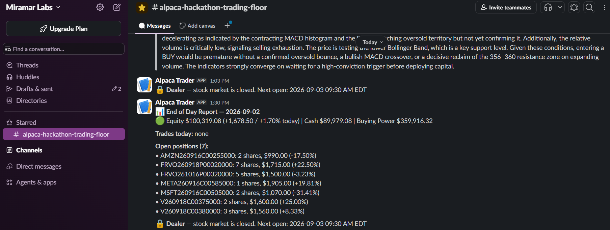

# Alpaca AI Trading Agents Hackathon — Submission Write-up

**Event:** Alpaca AI Trading Agents Hackathon (lablab.ai), 28 Aug – 4 Sep 2026
**Repo:** [miramar-labs/alpaca-options-trading-agents](https://github.com/miramar-labs/alpaca-options-trading-agents)
**Account:** a dedicated Alpaca paper account created for this hackathon, $100k starting balance

> Condensed one-page version for the submission form: [`hackathon-writeup.pdf`](hackathon-writeup.pdf).
> Slide deck: [`hackathon-deck.pdf`](hackathon-deck.pdf).

## What it is

A three-agent trading floor that autonomously trades **options** on US equities. Every
morning it picks a watchlist; every ten minutes during market hours it decides BUY/HOLD/SELL
on each symbol, and — the core of this submission — hands every non-HOLD signal to an
**Alpaca MCP tool-calling agent** that browses the live option chain and picks a specific
contract (strike, expiration, right) to trade, instead of trading the underlying stock
directly. A separate execution service places the order, watches it, and manages its own
synthetic stop-loss/take-profit/expiration exits since Alpaca has no server-side bracket orders
for options.

Everything runs live, continuously, on a Kubernetes cluster, against a dedicated Alpaca paper
account created for this hackathon — not a backtest, not a demo script run once for a screen
recording.

## What's new here

This builds on an existing multi-agent equity-trading framework of mine — the Analyst /
Dealer / Floor Broker structure, the layered risk gates, and the config-as-URL loader
predate the hackathon and trade the underlying stock directly. The hackathon work is the
options capability: the Alpaca MCP contract-selection agent (the core of this submission),
the options execution path in the Floor Broker, options-specific risk gates and the synthetic
stop-loss / take-profit / expiration exits, the end-of-day Slack report, and packaging the
whole thing as a live, continuously-trading deployment. Everything in this repo's
[commit history](https://github.com/miramar-labs/alpaca-options-trading-agents/commits/main)
is that work, done during the competition week. Crypto trading, a backtest harness, and a
nightly power scheduler exist in the upstream framework but were left out as out of scope.

## The problem

Turning a directional stock call ("this looks like a buy") into an actual options trade is a
second, harder decision: which expiration, which strike, is the premium sane, does the delta
match the intended exposure. That's normally a human options trader's job. This project puts
an LLM agent in that seat, giving it live read access to Alpaca's option chain/quotes/Greeks
through MCP and letting it reason its way to a specific contract — while a deterministic,
non-LLM layer underneath re-validates every constraint (DTE window, delta window, notional cap,
duplicate check) before anything actually executes, so a bad or hallucinated model output can't
directly place a bad trade.

## Architecture at a glance

```
Analyst (CronJob, 08:55 ET)  →  portfolio ConfigMap  →  Dealer (poll loop, every 600s)
                                                              │
                                                   BUY/HOLD/SELL signal (LLM)
                                                              │
                                              non-HOLD  ──────┘
                                                 │
                                    Alpaca MCP tool-calling loop
                                    (option chain → pick a contract)
                                                 │
                                    Floor Broker (FastAPI) → Alpaca
                                    server-side re-validation, order
                                    placement, synthetic SL/TP/DTE exit
```

Full technical detail — every node, every gate, the config reference, the DB schema — is in
[`docs/architecture.md`](architecture.md). The short version:

- **Analyst** — a LangGraph pipeline: screens Alpaca movers + a fixed large-cap list, pulls
  news and TAAPI technical indicators, reads back its own recent track record from Postgres,
  and asks an LLM to pick the day's watchlist with a budget and rationale per symbol.
- **Dealer** — a long-running poll loop. For each watchlisted symbol it fetches indicators and
  OHLCV-derived market structure, asks an LLM for BUY/HOLD/SELL, and for any non-HOLD signal
  launches the MCP contract-selection agent below.
- **Floor Broker** — a stateless FastAPI service that is the only component allowed to touch
  Alpaca's trading API. It re-validates every constraint server-side, places the order, and
  runs three background poll loops: fill detection, synthetic option stop-loss/take-profit/
  DTE-force-close, and restart recovery (rebuilding all in-memory tracking from Alpaca + Postgres
  if the pod restarts mid-position).
- **EOD Report** — a daily CronJob that posts a plain-language account/trade recap to Slack,
  independent of the trading loop above.

Every agent process is stateless between runs, so the Postgres tables are more than an audit
trail — they are the agents' **memory across cycles**. The Analyst and Dealer read their own
past picks, decisions, and execution outcomes back into their prompts on the next run, and the
win-rate throttle and same-symbol stop cooldown are computed from the same history.

## The Alpaca MCP integration

This is the feature the whole submission is built around, so it's worth calling out on its
own. `src/dealer/mcp_options.py` launches the `alpaca-mcp-server` package over stdio
(`langchain-mcp-adapters`' `MultiServerMCPClient`) with a **read-only** toolset
(`assets,options-data,account`) — the Dealer can look at the option chain, quotes, and Greeks,
but it can never place an order itself; only Floor Broker can do that, over a separate plain
REST call.

Given the underlying symbol, the desired direction (call for a bullish signal, put for a
bearish one — options here are always a long position, never a short), and the config's DTE
and delta windows, the LLM drives a bounded tool-calling loop (≤6 rounds) to pull the live
chain and settle on one contract, returned as structured output: strike, expiration, delta,
mid-price premium, and its reasoning. That pick is then:

1. **Validated** — rejected outright if it claims the wrong option type for the signal's
   direction, or names a contract that was never actually seen in a chain response (a
   hallucination).
2. **Reconciled** — its strike/expiration/delta/premium are overwritten with what the chain
   actually showed for that exact contract; only the reasoning text is trusted from the model.
3. **Re-validated a second time**, server-side in Floor Broker, against the live DTE/delta
   windows and a live re-quote of the ask price before an order is submitted.

## Risk management

Layered gates sit between "the LLM said BUY" and "an order reaches Alpaca": a confidence
threshold on the signal itself, a macro-event blackout calendar (FOMC/CPI/jobs/PCE dates), a
same-symbol stop-loss cooldown, a portfolio win-rate throttle, a daily profit-target/loss-limit
halt, an operator-flippable kill switch (no redeploy needed), a DTE/delta window
re-validation, and a hard notional cap enforced against the market rather than the model's
claimed price. Once a position is open, Alpaca has no server-side bracket order for options, so
Floor Broker runs its own 30-second poll loop that force-closes on a 50% loss, a 175% gain, or
expiration dropping to 3 days out — whichever comes first, and regardless of whether the
system's ability to *open* new positions is currently gated.

## Deployment

The whole stack runs on a DGX Spark k3s cluster — a machine powered entirely by on-site
**solar**, so every local inference is also off-grid — deployed by a GitHub Actions CI/CD chain
on a self-hosted runner: every push runs tests + lint, a green run on `main` builds and pushes four
container images to GHCR, and a green build triggers a rolling deploy to the
`alpaca-options-trader` namespace. Config (`config.yaml`) is fetched fresh from GitHub at
runtime by every pod every 60 seconds rather than baked into the image, so most tuning —
risk thresholds, blackout dates, even the LLM model — is a plain `git push`, no rebuild or
redeploy required. The README's live P/L and "Dealer LLM" badges are refreshed the same way, by
small scheduled jobs that read the account and `config.yaml` and commit the result.

## Tech stack

- **LangGraph** for both agents' decision graphs; **LangChain** (`ChatOpenAI` against an
  OpenAI-compatible endpoint) plus `langchain-mcp-adapters` for the MCP tool-calling loop
- **Alpaca** (`alpaca-py`) — trading, market data, news, options chain/quotes/Greeks, all
  against the one paper account
- **alpaca-mcp-server** — the official MCP server exposing Alpaca's tools, run locally as a
  stdio subprocess per Dealer poll
- **Ollama**, self-hosted on a 100% solar-powered DGX Spark, serving `qwen2.5:32b-instruct-q4_K_M`
  as the LLM behind every agent decision — no external LLM API calls (see `docs/models.md`)
- **FastAPI** (Floor Broker), **Postgres** (shared platform instance — cross-cycle agent
  memory, audit trail, DB-backed reconciliation), **Kubernetes/k3s**, **GitHub Actions** (CI/CD + badges),
  **TAAPI.io** (technical indicators), **Finnhub** (earnings calendar), **Slack** (notifications)

## Challenges & learnings

**Structured output on a local model, under an agentic loop, is the hard part — not the MCP
plumbing itself.** The MCP tool-calling loop genuinely works end-to-end: the agent calls the
right tools, pulls real chain data, and reasons about it. But the `.with_structured_output()`
call at the *end* of that loop — the one that has to emit a populated `OptionContractPick` —
came back empty on the first model we ran, `qwen3.6:35b-a3b`, on **every** cycle: all seven
option positions, all opened on 1 Sep, were placed by the deterministic fallback picker, not the
model. We first read this as an Ollama constrained-decoding quirk tied to the long, tool-heavy
context. It wasn't: instrumenting the failing call showed a ~4k-token prompt against a 32k
window returning `content=''` after a single token — a constrained-decoding failure driven by
`qwen3.6:35b-a3b`'s low active-parameter count (a 35B MoE with only ~3B active), not by context
length. Smaller single-turn structured calls (the Dealer's own BUY/HOLD/SELL `Signal`) mostly
succeeded because the schema is smaller. Rather than let an empty result mean "no trade
happens," the system
falls back to a deterministic contract picker (`_fallback_pick`) that selects directly from the
chain rows the loop already fetched, using the same delta/DTE/quote gates the LLM was asked to
apply — so a structured-output miss degrades to "the code picks the contract the same way a
human would skim the chain" rather than silently doing nothing. The fix landed inside the
window: each candidate model was run through the *actual* contract-selection path against live
Alpaca MCP data — the check is committed as `scripts/check_contract_selection.py` (see
`docs/models.md` for the table). `gpt-oss:120b` failed the same way; `llama3.3:70b-q4` worked
but was slow; a dense **`qwen2.5:32b-instruct-q4_K_M`** produced valid, chain-consistent
structured picks at ~10 tok/s and is now the configured model. Re-run post-switch on NVDA,
TSLA and AAPL it returned real picks (`fell_back=False`) every time, correct right and inside
the delta/DTE windows. `_fallback_pick` stays in place as a first-class safety net rather than
a rare edge case. A
guided-decoding backend (vLLM/SGLang/NIM) would make this bulletproof regardless of model and
is the right long-term answer — it is an infrastructure migration off Ollama that did not fit
the window.

**Everything downstream of a model call needs to assume the model is adversarial, not just
wrong.** The validate → reconcile → re-validate chain around the option pick wasn't originally
written with "the LLM is hostile" in mind — it grew out of ordinary defensive programming
against a locally-hosted model's occasional bad output. But by the time it was done, it also
happens to block the more interesting failure modes: a pick that names a real contract but
invents a fabricated premium, or a call-labeled pick whose OCC symbol is actually a put. None of
that trust boundary is unique to a competition setting — it's the same posture the pre-existing
non-hackathon version of this system already needed for real paper-money trades.

## Results

*Snapshot at the 4 Sep 2026 close — the final day of the competition window, with the system
still running. The live P/L badges in the README and the `options_trades` /
`floor_broker_events` tables in Postgres are the current source of truth.*

**Trading activity, day by day.** All 7 option positions this account has ever held were opened
in a single session on **1 Sep** — the Dealer polled the watchlist every 600s; the great majority
of calls were HOLD, with a couple of dozen BUY signals and a handful of SELL. Positions that
didn't get opened were stopped before execution by the risk layer: seven below the 0.6 confidence
floor, several as duplicates of a position already open or an order already in flight, three
because no contract in the fetched chain passed the DTE / delta / open-interest / volume gates.
All 7 submitted orders filled (100%), each within half a minute. Every session since has been
capped by a *different* one of the eight risk gates rather than by a lack of signal:

- **2 Sep** — the Dealer fired 16 real BUY signals across the day's universe (NVDA, JPM, MSFT,
  V…), every one rejected at the door. The **daily profit-target halt** tripped as early as
  10:03am ET, ~30 minutes into the session, once intraday P/L cleared +$1,000, and then held for
  the rest of the day (`option_skipped: daily P&L $3,078.50 >= target $1000` by early afternoon).
  The confidence floor and the duplicate-position guard rejected the rest. Zero new entries by
  design, not by accident.
- **3 Sep** — no new BUY signals reached execution; the day's only fills were the **first two
  automated take-profit exits**: MSFT 505C (entry $7.80 → exit $12.85, +64.7%) and META 585C
  (entry $15.90 → exit $28.50, +79.2%), for **+$2,270 realised**, both winners.
- **4 Sep** — a config-scheduled **macro-event blackout** (NFP / jobs report day) blocked all new
  BUY entries for the full session by design; SELL/HOLD/exits were unaffected. No exits
  triggered on the day.

**Open book (4 Sep close).** 5 positions remain from the original 7 — 3 long calls, 2 long puts —
after the two 3 Sep take-profit exits. Account equity **$101,298.81 (+1.3% vs the $100k open)**,
sum unrealized P/L **−$970**:

| Contract | Unrealized P/L |
|---|---|
| AMZN 255C | +$180 (+15.0%) |
| V 375C | −$210 (−16.4%) |
| V 380C | −$510 (−35.4%) |
| FRVO 20P (exp 18 Sep) | −$280 (−20.0%) |
| FRVO 20P (exp 16 Oct) | −$150 (−9.7%) |

V 380C is the current laggard at −35.4%, still short of the −50% synthetic stop-loss threshold,
so it remains open under the exit loop's own terms rather than being force-closed early.



**Risk gates, observed firing.** Across the four sessions, four of the eight deterministic gates
have been caught live in the act: the confidence floor and duplicate-position guard (1–2 Sep),
the daily profit-target halt (2 Sep), and the macro-event blackout (4 Sep) — plus the synthetic
take-profit exit firing twice, cleanly, on 3 Sep. No synthetic stop-loss or DTE-force-close has
triggered yet — no open position has hit −50% or 3 DTE.

**Contract selection on days 1–2 ran entirely on the deterministic fallback.** All 7 contracts
above were chosen by `_fallback_pick`, not the model's structured output — each trade's stored
reasoning reads *"deterministic fallback: structured LLM pick unavailable."* The MCP
tool-calling loop itself worked every cycle: the agent called the chain / quote / greeks tools
and pulled live data. Only the closing `.with_structured_output()` step returned empty, so the
deterministic picker selected from the exact chain rows the loop had already fetched, under the
same gates. On 2 Sep the model was switched to `qwen2.5:32b-instruct-q4_K_M` after real-path
testing (`scripts/check_contract_selection.py`) showed it returns valid structured picks —
`fell_back=False` on NVDA, TSLA and AAPL — where `qwen3.6:35b-a3b` returned empty; contract
selection from that point runs on the model, with `_fallback_pick` as the safety net.
See [Challenges & learnings](#challenges--learnings) and `docs/models.md` for the full story.

## Repo

MIT-licensed, public: [github.com/miramar-labs/alpaca-options-trading-agents](https://github.com/miramar-labs/alpaca-options-trading-agents).
Development happened as real, dated commits across the competition week — see the
[commit history](https://github.com/miramar-labs/alpaca-options-trading-agents/commits/main)
and the live Test/Lint + Build/Push CI badges in the README.
